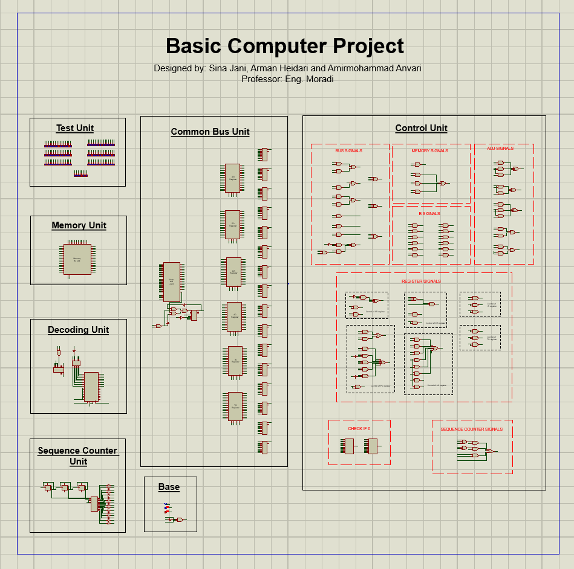

# M. Morris Mano's Basic Computer Design

[](https://www.labcenter.com/)
[](docs/architecture.md)
[](LICENSE)

A complete hardware simulation of the classical **Basic Computer** described by **M. Morris Mano** in *Computer System Architecture* (Chapter 5), built and simulated using **Proteus Design Suite**.

---

## 📸 Complete System Schematic

Below is the complete, fully-integrated circuit schematic designed in Proteus:

<p align="center">
  
</p>

> **Designers:** Sina Jani, Arman Heidari, Amirmohammad Anvari  
> **Course Supervisor:** Eng. Moradi

---

## 📑 Table of Contents

- [Overview](#-overview)
- [Repository Structure](#-repository-structure)
- [Computer Architecture & Subsystems](#-computer-architecture--subsystems)
- [Preloaded Test Program](#-preloaded-test-program)
- [Simulation Guide](#-simulation-guide)
- [Documentation Links](#-documentation-links)
- [Authors & Acknowledgments](#-authors--acknowledgments)
- [License](#-license)

---

## 🔍 Overview

The **Basic Computer** is a 16-bit accumulator-based computer architecture that serves as the cornerstone for understanding computer engineering and hardware organization. 

### Key Specifications:
* **Word Size:** 16 bits
* **Memory Capacity:** 4096 words × 16 bits (4K × 16), addressed via a 12-bit address bus (`0x000` to `0xFFF`)
* **Common Bus:** 16-bit multiplexer-based bus (using 74151 8-to-1 multiplexers)
* **Registers:**
  * **AR (Address Register):** 12 bits
  * **PC (Program Counter):** 12 bits
  * **DR (Data Register):** 16 bits
  * **AC (Accumulator):** 16 bits
  * **IR (Instruction Register):** 16 bits
  * **TR (Temporary Register):** 16 bits
  * **SC (Sequence Counter):** 4 bits (generates timing pulses $T_0$ to $T_{15}$)
  * **Flags:** Addressing Mode ($I$), Carry/Extended ($E$), Start/Stop ($S$)
* **Control Unit:** Fully hardwired combinational control unit with instruction decoding ($D_0 - D_7$) and timing signals ($T_0 - T_{15}$).

---

## 🗂 Repository Structure

The repository is organized into a clean, modular structure:

```text
Basic-Computer/
├── assets/
│   └── circuit_overview.png              # Complete schematic capture from Proteus
├── circuits/
│   ├── FinalVersion.pdsprj               # Main complete integrated computer simulation
│   ├── DATA.BIN                          # RAM High Byte (bits 15-8) memory image
│   ├── DATA2.BIN                         # RAM Low Byte (bits 7-0) memory image
│   ├── modules/                          # Individual modular sub-circuit projects
│   │   ├── ALU.pdsprj                    # Arithmetic Logic Unit & Adder subsystem
│   │   ├── Common_Bus.pdsprj             # 16-bit Multiplexer Common Bus system
│   │   ├── Memory_Unit.pdsprj            # RAM design (4Kx16 memory block)
│   │   ├── Registers.pdsprj              # General register block (AR, PC, DR, AC, etc.)
│   │   ├── Sequence_Counter.pdsprj       # 4-bit Sequence Counter & timing generator
│   │   ├── Control_Signals.pdsprj        # Control logic and signal routing
│   │   ├── DATA.BIN                      # Binary copy for standalone memory testing
│   │   └── DATA2.BIN                     # Binary copy for standalone memory testing
│   └── archive/                          # Historical development iterations and milestones
│       ├── CENTRALIZED_SYSTEM.pdsprj
│       ├── CENTRALIZED_SYSTEM_Day3.pdsprj
│       ├── CENTRALIZED_SYSTEM_Day3_Update.pdsprj
│       ├── CENTRALIZED_SYSTEM_Edit_Write.pdsprj
│       ├── CENTRALIZED_SYSTEM_Last_Version.pdsprj
│       ├── CENTRALIZED_SYSTEM_20230713_174127.pdsprj
│       └── temp_signals.pdsprj
├── docs/
│   ├── architecture.md                   # In-depth architectural specification
│   └── instruction_set.md                # Full instruction set & micro-operations reference
├── programs/
│   ├── sample_program.asm                # Mano assembly source of preloaded test code
│   ├── DATA.BIN                          # Reference copy of high-byte memory binary
│   └── DATA2.BIN                         # Reference copy of low-byte memory binary
├── .gitignore                            # Proteus temporary and workspace ignore rules
├── LICENSE                               # MIT License
└── README.md                             # Project documentation
```

---

## ⚙️ Computer Architecture & Subsystems

As shown in the circuit diagram, the implementation is decomposed into clean functional units:

### 1. Test Unit
Provides real-time visualization of bus lines, register values, and control flags using logic state indicators, probes, and LED arrays.

### 2. Memory Unit
Implements the 4096 × 16-bit memory space using two parallel **27512** memory chips:
* **High Byte (`DATA.BIN`):** Feeds data bits `D15` through `D8`.
* **Low Byte (`DATA2.BIN`):** Feeds data bits `D7` through `D0`.
* Supports synchronous **Read** (placing $M[AR]$ on the Common Bus) and **Write** (writing Bus content into $M[AR]$).

### 3. Decoding Unit
Decodes the 16-bit instruction residing in the **Instruction Register (IR)**:
* **Opcode Decoder:** 3-to-8 decoder (74HC238) decodes `IR[14:12]` into signals $D_0$ through $D_7$.
* **Addressing Mode:** Flip-flop storing bit `IR[15]` ($I = 0$: direct addressing, $I = 1$: indirect addressing).
* **Timing Decoder:** 4-to-16 decoder translates the 4-bit Sequence Counter into timing cycles $T_0$ through $T_{15}$.

### 4. Sequence Counter Unit
A 4-bit synchronous counter providing discrete clock cycles $T_0$ to $T_{15}$ for the fetch, decode, and execute phases. Resets to 0 ($SC \leftarrow 0$) whenever an instruction completes or on system reset.

### 5. Common Bus Unit
A 16-bit multiplexed bus using 74151 8-to-1 data selectors to transfer data between registers:
* **Selection Code ($S_2 S_1 S_0$):**
  * `001`: **AR** (Address Register)
  * `010`: **PC** (Program Counter)
  * `011`: **DR** (Data Register)
  * `100`: **AC** (Accumulator)
  * `101`: **IR** (Instruction Register)
  * `110`: **TR** (Temporary Register)
  * `111`: **Memory** ($M[AR]$)

### 6. Control Unit
The brain of the machine, synthesized from combinational logic gates:
* **Bus Signals:** Generates $S_2, S_1, S_0$ based on current opcode and timing state.
* **Memory Signals:** Generates `READ` and `WRITE` strobes.
* **Register Signals:** Generates individual `LD` (Load), `INR` (Increment), and `CLR` (Clear) signals for each register.
* **ALU Signals:** Dictates the operation of the 16-bit adder and logic circuit (`AND`, `ADD`, `CMA`, `CIR`, `CIL`, `INC`, etc.).
* **Check If 0:** Evaluates conditional skip operations (e.g., zero flag, sign bit).
* **Sequence Counter Signals:** Generates `INR` and `CLR` pulses for the Sequence Counter.

### 7. Base Unit
Supplies master clock pulses, digital ground/VCC power rails, and global system reset signals.

---

## 💻 Preloaded Test Program

The included memory image files (`DATA.BIN` and `DATA2.BIN`) contain a test program assembled directly into Mano machine code to verify all major CPU functional paths:

| Address | Hex Code | Mano Assembly | Explanation |
| :---: | :---: | :--- | :--- |
| `0x000` | `2082` | `LDA 082` | **Direct Load:** Load contents of memory address `0x082` (`0xA937`) into `AC`. |
| `0x001` | `8041` | `AND 041 I` | **Indirect AND:** Address `0x041` holds pointer `0x083`. Compute $AC \leftarrow AC \land M[083]$. |
| `0x002` | `1084` | `ADD 084` | **Direct ADD:** Add value at location `0x084` (`0xB8F2`) to `AC` (carry out into `E`). |
| `0x003` | `2085` | `LDA 085` | **Direct Load:** Load value from location `0x085` (`0xB8F2`) into `AC`. |
| `0x004` | `3086` | `STA 086` | **Direct Store:** Store contents of `AC` into memory address `0x086`. |
| `0x005` | `7020` | `INC` | **Register Operation:** Increment Accumulator ($AC \leftarrow AC + 1$). |
| `0x006` | `7200` | `CMA` | **Register Operation:** 1's Complement Accumulator ($AC \leftarrow \overline{AC}$). |
| `0x041` | `0083` | `HEX 0083` | Pointer variable pointing to target address `0x083`. |
| `0x082` | `A937` | `HEX A937` | Operand 1 (`0xA937`). |
| `0x083` | `B8F2` | `HEX B8F2` | Operand 2 (`0xB8F2`). |
| `0x084` | `B8F2` | `HEX B8F2` | Operand 3 (`0xB8F2`). |
| `0x085` | `B8F2` | `HEX B8F2` | Operand 4 (`0xB8F2`). |
| `0x086` | `0000` | `HEX 0000` | Result storage location for `STA 086`. |

See [`programs/sample_program.asm`](programs/sample_program.asm) for the full annotated assembly source.

---

## 🚀 Simulation Guide

### Requirements
* **Proteus Design Suite 8.13** or newer.

### Steps to Run:
1. **Clone the repository:**
   ```bash
   git clone https://github.com/armanheidari/Basic-Computer.git
   ```
2. **Open the Project:**
   * Launch Proteus.
   * Open `circuits/FinalVersion.pdsprj`.
3. **Verify Memory Files:**
   * The memory chips in the **Memory Unit** will automatically locate `DATA.BIN` and `DATA2.BIN` from the `circuits/` folder.
4. **Start Simulation:**
   * Press the **Play / Run Simulation** button (or press `F12` in Proteus).
   * Observe the Sequence Counter stepping through $T_0 \to T_1 \to T_2 \to \dots$.
   * Watch the register LED indicators in the **Test Unit** update as instructions are fetched, decoded, and executed!

---

## 📚 Documentation Links

* [Architecture & Subsystems Reference](docs/architecture.md) — Detailed explanation of registers, bus multiplexing, ALU, and control unit.
* [Instruction Set Architecture (ISA)](docs/instruction_set.md) — Complete table of Memory-Reference, Register-Reference, and I/O instructions with micro-operation timing.
* [Sample Assembly Program](programs/sample_program.asm) — Assembly test code with hex mappings.

---

## 👥 Authors & Acknowledgments

* **Sina Jani**
* **Arman Heidari**
* **Amirmohammad Anvari**

Supervised with thanks to **Eng. Moradi**.

---

## 📄 License

This project is licensed under the **MIT License** — see the [LICENSE](LICENSE) file for details.
